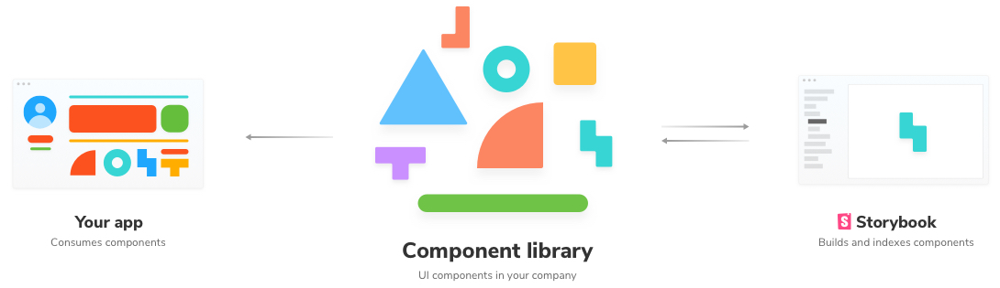

# Storybook and Chromatic tutorial

This tutorial is a quick overview that walks you through installing Storybook and integrating Chromatic. It's intended for folks who haven't yet used Storybook.

If you're already using Storybook, then great!---skip to the [get started](/) guide. If you'd prefer to learn Storybook in a free 10-chapter tutorial take a look at [Learn Storybook](https://www.learnstorybook.com/).

#### How Chromatic works (in brief)

Chromatic tests takes image snapshots of various configurations of your components. These configurations, or inputs to your components, are the specification of how the test should operate. We rely on Storybook "stories" to provide these configurations. Chromatic's review feature also utilizes snapshots to narrow down the changes reviewers have to see. Chromatic publishes a secure, versioned storybook to the cloud.

---

## What is Storybook?

Storybook is the leading [component explorer](https://blog.hichroma.com/the-crucial-tool-for-modern-frontend-engineers-fb849b06187a) for React, Angular, and Vue. It provides a dedicated UI that helps you visualize, interact, and develop your component states (called "stories" in Storybook) even as you create them. When embedded in your development workflow, it's a timesaving tool for developing apps from the ground up in a [component-driven](https://blog.hichroma.com/component-driven-development-ce1109d56c8e) fashion.



For visual testing, Storybook helps you create visual test specifications as stories. Chromatic syncs with your stories to automate visual testing. If you change a story, your Chromatic test will also change. When a change is detected in Chromatic, we notify you, and direct you to the Storybook story that needs to be reviewed.

---

## Install Storybook

Storybook is easy to setup. First add the package using the `getstorybook` command from within your app:

```bash
npx -p @storybook/cli getstorybook

# Or if you do not have npx
npm install -g @storybook/cli
getstorybook
```

The `getstorybook` command will install some important development dependencies, add some npm scripts to start your Storybook, and create a `.storybook` directory inside your app.

You can start your Storybook now with:

```bash
npm run storybook
```

### Configure Storybook

Chances are you will not need to configure Storybook further, but if your components make use of unusual webpack loaders or other tricks, you may need to [configure Storybook's webpack config](https://storybook.js.org/configurations/custom-webpack-config/).

---

## Setup `.storybook/config.js`

We recommend a few changes to the default `.storybook/config.js` that controls the way your Storybook loads:

```javascript
import { configure } from "@storybook/react";

// 2. If you have a global CSS file, import it here:
import "../src/index.css";

// 3. Load a X.story.js file for each of your components/X.js:
configure(require.context("../src/components", true, /\.story\.js$/), module);
```

You can also remove the default stories created at `.storybook/stories`.

---

## Write your first stories

Let's suppose you want to test a component named `Histogram`, that lives at `src/components/Histogram.js`.

Simply create a file called `src/components/Histogram.story.js` and write the following:

```js
import React from "react";
import { storiesOf } from "@storybook/react";

import Histogram from "./Histogram";

export default {
  component: Histogram,
  title: Histogram.displayName,
};

export const Loading = () => <Histogram loading />;
export const FullData = () => (
  <Histogram
    series={[
      { x: 1, y: 1 },
      { x: 2, y: 2 },
    ]}
  />
);
```

This will create two stories for the Histogram, and you can browse to your Storybook (which you ran earlier with `npm run storybook`) to view the implementation (obviously adjust the component and props above to be relevant to your app).

When you are satisfied that your stories are sensible, you can start up your first Chromatic build and set the baselines for these stories with:

```bash
./node_modules/.bin/chromatic --app-code=<your-app-code>
```

Grab the app code from [www.chromatic.com](https://www.chromatic.com) and view the resultant build there to ensure the stories are snapshotted correctly. Read more about [running tests](/test).

---

## Resources

- [Learn Storybook](https://learnstorybook.com) Step by step guides on learning Storybook and component development best practices
- [Visual Testing Handbook](https://www.learnstorybook.com/visual-testing-handbook/) a free 31-page walkthrough for visual testing with Storybook
- [How Storybook fits into your workflow](https://blog.hichroma.com/component-driven-development-ce1109d56c8e)
- [Storybook docs](https://storybook.js.org/basics/introduction/)
- [Component explorers](https://blog.hichroma.com/the-crucial-tool-for-modern-frontend-engineers-fb849b06187a) are the essential tool for component development
- [Visual testing tools](https://www.chromatic.com/choose/visual-testing)
