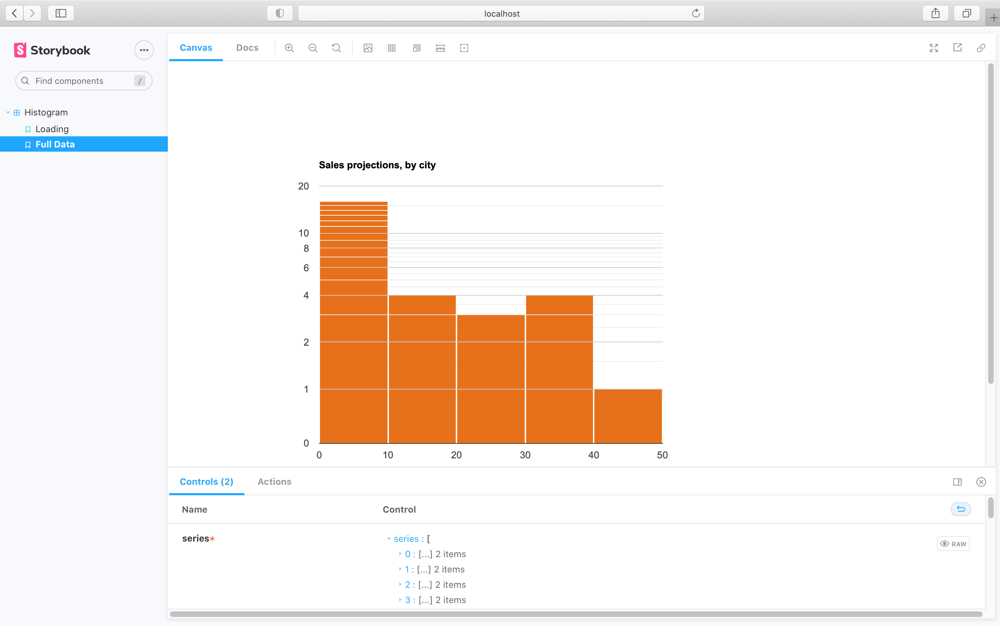
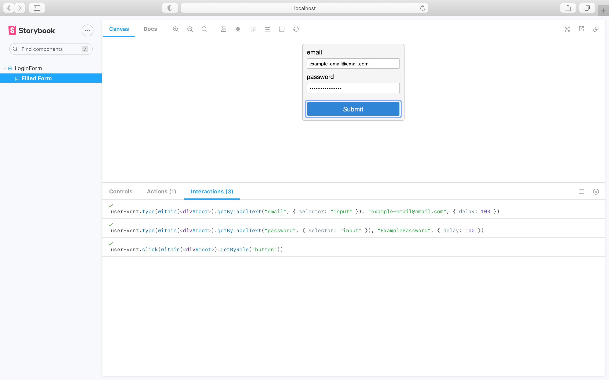

# Storybook and Chromatic tutorial

This tutorial is a quick overview that walks you through installing Storybook, using some of its core features, and integrating Chromatic. It's intended for folks who haven't yet used Storybook.

If you're already using Storybook, then great!---skip to the [get started](/docs/) guide. If you'd prefer to learn Storybook in a free 11-chapter tutorial, take a look at the [Intro to Storybook tutorial](https://storybook.js.org/tutorials/intro-to-storybook/).

#### How Chromatic works (in brief)

Chromatic publishes your Storybook to a secure CDN with every commit. It uses your Storybook's stories for visual regression testing and UI review.

An image snapshot is taken of each story every commit. Chromatic compares these snapshots to previous versions to identify bugs for [UI Tests](test). And it compares snapshots _between branches_ to generate a changeset for [UI Review](review) (similar to code review).

---

## What is Storybook?

Storybook is the leading [component explorer](https://blog.hichroma.com/the-crucial-tool-for-modern-frontend-engineers-fb849b06187a) for React, Angular, and Vue. It provides a dedicated UI that helps you visualize, interact, and develop your component states (called "stories" in Storybook) even as you create them. When embedded in your development workflow, it's a timesaving tool for developing apps from the ground up in a [component-driven](https://www.componentdriven.org/) fashion. Storybook is an essential tool for developers building Component Libraries for Design System (read our [guide](https://storybook.js.org/tutorials/design-systems-for-developers/)).


For visual testing, Storybook helps you create visual test specifications as stories. Chromatic syncs with your stories to automate visual testing. If you change a story, your Chromatic test will also change. When a change is detected in Chromatic, we notify you and direct you to the Storybook story that needs to be reviewed. For [UI review](review), Chromatic shows you the visual differences in stories that are introduced by PRs.

---

## Install Storybook

Storybook is easy to set up. Within your app, run the following command:

```bash
npx sb init
```

The `sb init` command will install the necessary development dependencies, configuration files (located in the `.storybook` directory), set up the required scripts, and add some examples inside your app.

You can start your Storybook now with:

```bash
# With npm
npm run storybook

# With yarn
yarn storybook
```

### Configure Storybook

Chances are you will not need to configure Storybook further. But if you need to:

- Adjust [story loading](https://storybook.js.org/docs/react/configure/overview#configure-story-loading).
- Customize [webpack configuration](https://storybook.js.org/docs/react/configure/webpack#extending-storybooks-webpack-config).
- Register and configure additional [addons](https://storybook.js.org/docs/react/configure/storybook-addons).

You can use `.storybook/main.js` to apply the required configurations.

---

## Setup `.storybook/preview.js`

If you need to load custom styles, we recommend importing them into [`.storybook/preview.js`](https://storybook.js.org/docs/react/configure/overview#configure-story-rendering).

```javascript
// .storybook/preview.js

// Global CSS for the app
import "../src/index.css";
```

---

## Write your first stories

Suppose you want to test a `Histogram` component that lives at `src/components/Histogram.js`.

Create a file called `src/components/Histogram.stories.js` and write the following:

```js
// src/components/Histogram.stories.js|jsx|ts|tsx

import React from "react";

import { Histogram } from "./Histogram";

export default {
  component: Histogram,
  title: "Histogram",
};

/*
 * Read more about Storybook templates at:
 * https://storybook.js.org/docs/react/writing-stories/introduction#using-args
 */
const Template = (args) => <Histogram {...args} />;

export const Loading = Template.bind({});
/*
 * More on args at:
 * https://storybook.js.org/docs/react/writing-stories/args
 */
Loading.args = {
  loading: true,
};

export const FullData = Template.bind({});
FullData.args = {
  series: [
    ["City", "Sales"],
    ["New York City, NY", 12.2],
    ["Los Angeles, CA", 9.1],
    ["Chicago, IL", 12.2],
    ["'Houston, TX'", 22.9],
    ["Philadelphia, PA", 0.9],
    ["San Antonio, TX", 36.6],
    ["San Diego, CA", 9.2],
    ["Dallas, TX", 30.5],
    ["San Jose, CA", 6.1],
    ["Austin, TX", 2.7],
    ["Jacksonville, FL", 0.9],
    ["Forth Worth, TX", 2.7],
    ["Indianapolis, IN", 27.1],
    ["Charlotte, NC", 3.4],
    ["San Francisco, CA", 5.5],
    ["Nashville, TN", 21.0],
    ["Boston, MA)", 7.9],
    ["Portland, OR", 1.2],
    ["El Paso, TX", 4.6],
    ["Las Vegas, NV", 1.5],
    ["Memphis, TN", 7.9],
    ["Baltimore, MA", 2.0],
    ["Milwaukee, WI", 45.7],
    ["Albuquerque, NM", 12.2],
    ["Tucson, AR", 30.5],
    ["Fresno, CA", 15.2],
    ["Miami, FL", 30.5],
    ["BakersField, CA", 1.8],
  ],
};
```

This will create two stories for the Histogram component. Browse to Storybook, which you ran earlier, to view the implementation. This code example is for demo purposes; you'll need to adjust the component and props above to be relevant to your app.

<video autoPlay muted playsInline loop width="600px" class="center" style="pointer-events: none;">
  <source src="img/storybook-histogram-starter-state.mp4" type="video/mp4" />
</video>

---

### Using decorators

Decorators are one of Storybook's core features, allowing you to wrap your stories with custom providers (e.g., [Emotion's Theme Provider](https://emotion.sh/docs/theming)), or provide additional markup to render stories correctly.

Let's assume the Histogram component requires additional styling to render correctly. Update your story and add a decorator as follows:

```js
// src/components/Histogram.stories.js|jsx|ts|tsx

import React from "react";

import { Histogram } from "./Histogram";

export default {
  component: Histogram,
  title: "Histogram",
  /*
   * Read more about Storybook decorators at:
   * https://storybook.js.org/docs/react/writing-stories/decorators
   */
  decorators: [(story) => <div style={{ padding: "3rem" }}>{story()}</div>],
};

/*
 * Read more about Storybook templates at:
 * https://storybook.js.org/docs/react/writing-stories/introduction#using-args
 */
const Template = (args) => <Histogram {...args} />;

export const Loading = Template.bind({});
/*
 * More on args at:
 * https://storybook.js.org/docs/react/writing-stories/args
 */
Loading.args = {
  loading: true,
};

export const FullData = Template.bind({});
FullData.args = {
  series: [
    ["City", "Sales"],
    ["New York City, NY", 12.2],
    ["Los Angeles, CA", 9.1],
    ["Chicago, IL", 12.2],
    ["'Houston, TX'", 22.9],
    ["Philadelphia, PA", 0.9],
    ["San Antonio, TX", 36.6],
    ["San Diego, CA", 9.2],
    ["Dallas, TX", 30.5],
    ["San Jose, CA", 6.1],
    ["Austin, TX", 2.7],
    ["Jacksonville, FL", 0.9],
    ["Forth Worth, TX", 2.7],
    ["Indianapolis, IN", 27.1],
    ["Charlotte, NC", 3.4],
    ["San Francisco, CA", 5.5],
    ["Nashville, TN", 21.0],
    ["Boston, MA)", 7.9],
    ["Portland, OR", 1.2],
    ["El Paso, TX", 4.6],
    ["Las Vegas, NV", 1.5],
    ["Memphis, TN", 7.9],
    ["Baltimore, MA", 2.0],
    ["Milwaukee, WI", 45.7],
    ["Albuquerque, NM", 12.2],
    ["Tucson, AR", 30.5],
    ["Fresno, CA", 15.2],
    ["Miami, FL", 30.5],
    ["BakersField, CA", 1.8],
  ],
};
```

Now, browse to your Storybook, and you'll see the updated state with the styling in effect.



### Using parameters

Storybook's parameters are a set of named static metadata, commonly used to control most of its features and addons. As an example, let's assume you're working on a page component that relies on an external data source for data. You could write the following story and meet the component's requirements by adding a `parameter` as such:

```js
// Page.stories.js|jsx|ts|tsx

import React from "react";

import { rest } from "msw";

import { Page } from "./Page";

export default {
  component: Page,
  title: "Page",
};

//👇The mocked data that will be used in the story
const TestData = {
  author: {
    userID: 1,
    name: "John",
  },
  content: {
    id: 1,
    userID: 1,
    title: "Sample",
    brief: "Lorem ipsum dolor sit amet, consectetur adipiscing elit.",
    content:
      "Lorem ipsum dolor sit amet, consectetur adipiscing elit, sed  do eiusmod tempor incididunt ut labore et dolore magna aliqua. Aenean et tortor at risus viverra adipiscing at in tellus. Elementum curabitur vitae nunc sed velit dignissim sodales. Neque convallis a cras semper auctor neque. Commodo odio aenean sed adipiscing. Aliquet nec ullamcorper sit amet. Sagittis vitae et leo duis ut diam quam. Egestas tellus rutrum tellus pellentesque eu tincidunt tortor aliquam. Lorem dolor sed viverra ipsum nunc aliquet bibendum enim. Dui accumsan sit amet nulla facilisi morbi tempus. Ac odio tempor orci dapibus ultrices in.",
  },
};

/*
 * Read more about Storybook templates at:
 * https://storybook.js.org/docs/react/writing-stories/introduction#using-args
 */
const Template = () => <Page />;

export const WithData = Template.bind({});
WithData.parameters = {
  msw: [
    rest.get("https://your-restful-endpoint/", (_req, res, ctx) => {
      return res(ctx.json(TestData));
    }),
  ],
};

export const Error = Template.bind({});
/*
 * Read more about Storybook templates at:
 * https://storybook.js.org/docs/react/writing-stories/parameters
 */
Error.parameters = {
  msw: [
    rest.get("https://your-restful-endpoint", (_req, res, ctx) => {
      return res(ctx.delay(800), ctx.status(403));
    }),
  ],
};
```

For this example, we've used the [MSW](https://mswjs.io/) package, a well-known library for mocking both RESTful and GraphQL endpoints, which has an official [Storybook addon](https://storybook.js.org/addons/msw-storybook-addon/). Still, you can apply the same principles to other libraries as well.

---

### Interactive stories

Building components and manually testing them in Storybook allows you to find edge cases. With Storybook, you write stories for each variation by supplying the necessary inputs, customize how your component renders with [decorators](#using-decorators), or even mock API calls with [parameters](#using-parameters). But not all component states can be thoroughly tested without user intervention.

Storybook's interactive stories enable you to do just that. You can automate component interactions using a [`play`](https://storybook.js.org/docs/react/writing-stories/play-function) function, which includes small snippets of code that run after the story renders—scripting the exact steps a user would take to interact with the component.

Let's see how to set up interactive stories by adding the [`@storybook/addon-interactions`](https://storybook.js.org/addons/@storybook/addon-interactions/) and creating an interactive story using a simple login component.

Inside your app, run the following command to install the addon and its dependencies:

```bash
# With npm
npm install @storybook/addon-interactions @storybook/testing-library --save-dev

# With yarn
yarn add --dev @storybook/addon-interactions @storybook/testing-library
```

Update your Storybook configuration (located in `.storybook/main.js`) and register the addon:

```js
// .storybook/main.js

module.exports = {
  stories: ["../src/**/*.stories.mdx", "../src/**/*.stories.@(js|jsx|ts|tsx)"],
  addons: [
    "@storybook/addon-links",
    "@storybook/addon-essentials",
    "@storybook/preset-create-react-app",
    "@storybook/addon-interactions", //👈 The addon registered here
  ],
};
```

Update your component's story to the following:

```js
// src/components/LoginForm.stories.js|jsx|ts|tsx

import React from "react";

import { userEvent, within } from "@storybook/testing-library";

import { LoginForm } from "./LoginForm";

export default {
  component: LoginForm,
  title: "LoginForm",
};

const Template = (args) => <LoginForm {...args} />;

export const FilledForm = Template.bind({});
/*
 * Read more about Storybook templates at:
 * https://storybook.js.org/docs/react/writing-stories/play-function
 */
FilledForm.play = async ({ canvasElement }) => {
  // Assigns canvas to the component root element
  const canvas = within(canvasElement);

  // Queries the component for an input with an aria-label prop named email
  const emailInput = canvas.getByLabelText("email", {
    selector: "input",
  });

  // Fills the input with the provided text
  await userEvent.type(emailInput, "example-email@email.com", {
    delay: 100,
  });

  // Queries the component for an input with an aria-label prop named password
  const passwordInput = canvas.getByLabelText("password", {
    selector: "input",
  });

  // Fills the input with the provided text
  await userEvent.type(passwordInput, "ExamplePassword", {
    delay: 100,
  });

  // Queries the component looking for a button based on its role
  const submitButton = canvas.getByRole("button");

  await userEvent.click(submitButton);
};
```

Start your Storybook, click the `FilledForm` story, check your `Interactions` panel to preview the list of interactions inside the story's `play` function.



The `play` function allowed us to interact with our component and quickly check how it responds when filling the form without needing human interaction.

---

## Deploy to Chromatic

When you are satisfied that your stories are sensible, you can start up your first Chromatic build and set the baselines for these stories with:

```bash
chromatic --project-token=<your-project-token>
```

Grab the project token from [www.chromatic.com](https://www.chromatic.com) and view the resultant build there to ensure the stories are snapshotted correctly. Read more about [running tests](test).

---

## Resources

- [Storybook tutorials](https://storybook.js.org/tutorials/) Step by step guides on learning Storybook and component development best practices
- [Visual Testing Handbook](https://storybook.js.org/tutorials/visual-testing-handbook/) a free 31-page walkthrough for visual testing with Storybook
- [Component Driven UIs](https://www.componentdriven.org/) How modularity is transforming design and frontend development
- [How Storybook fits into your workflow](https://www.componentdriven.org/)
- [Storybook docs](https://storybook.js.org/docs/react/get-started/introduction)
- [Component explorers](https://blog.hichroma.com/the-crucial-tool-for-modern-frontend-engineers-fb849b06187a) are the essential tool for component development
- [Visual testing tools](https://www.chromatic.com/choose/visual-testing)
