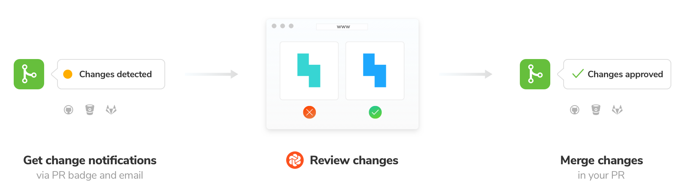
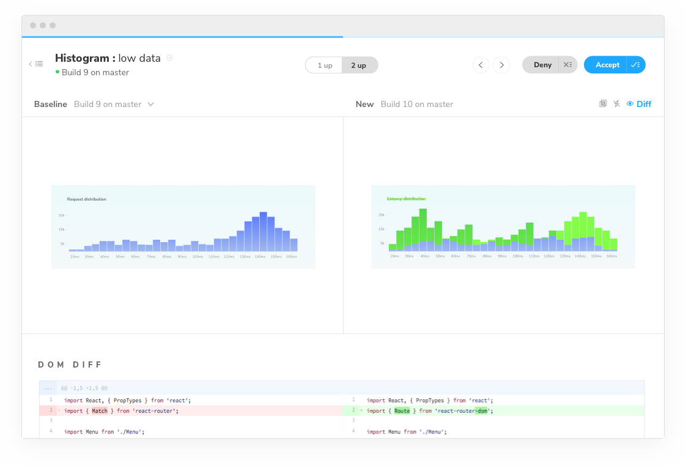
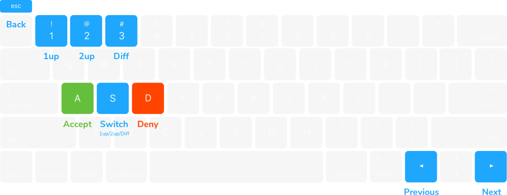
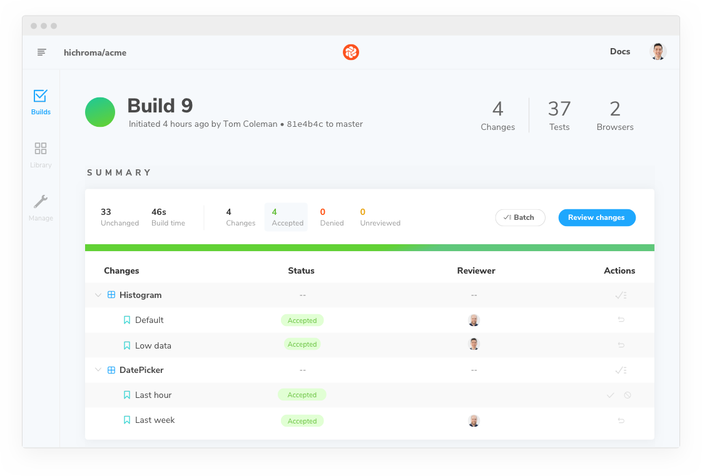

# Test

Visual testing ensures components dont change by accident. It’s still up to you to decide if changes are intentional. Chromatic automates visual testing by detecting UI changes betweeen commits.

If a change is intentional you need to update the baseline so future tests will be compared to the _latest version_ of the story. And if a change is unintentional it needs to be fixed.

---

## Detecting changes

1. Chromatic renders your stories in real browsers in the cloud. It takes a screenshot of each story, cropping it down to it's smallest bounding region. We call this a [Snapshot](snapshots).
2. The latest snapshots are compared to their baselines (i.e the last accepted snapshot) pixel-by-pixel. Chromatic's algorithm is built to avoid false positives by applying algorithms that ignore small random changes due to anti-aliasing and browser's non-determinism.
3. Chromatic shows you a diff of the changed pixels along with a diff of the DOM changes. _Note: It is only the visual diff that triggers changes, the DOM diff is purely informational._

## Establishing baselines

The first Chromatic build in a project (or branch without an ancestor) will use the visual snapshots it takes to establish [baselines](/branching-and-baselines) for every story.

Subsequent builds will compare snapshots against these baselines. As changes are accepted for particular stories, they'll become the new baselines for future builds.

## Reviewing builds

<video autoPlay muted playsInline controls width="560px" class="center">
  <source src="/img/website-workflow-review-merge-optimized.mp4" type="video/mp4" />
</video>

Each build new snapshots of your components are created and compared to the baselines. If there are visual changes the build will be marked "unreviewed".

Visual changes will need to be reviewed for the build to be "passed" or "failed". You can review changes 1-by-1 or in batches.

- ✅**Accept change**: This updates the story baseline. When a snapshot is accepted, it won’t need to be re-accepted until it changes, even through git branches, and merges.

- ❌**Deny change**: This badges the change as "denied" indicating a regression and immediately fails the build. You can deny multiple changes per build.

If you accept all the changes, the build will be marked "passed", and future builds of the same components will pass.

If you deny any of the changes, the build will be "failed" and you will need to make code changes (and thus start a new build) to get the build to pass.

#### Feature branches

Chromatic automatically changes the baseline snapshots that it uses for each build depending on your branch. This means you can update UI components on multiple feature branches in parallel without conflicts. Read more about the details [here](/branching-and-baselines).

#### Live View for reproductions

Along with pixel and DOM diffs, Chromatic renders the actual stories as they are in your Storybook 'live'. This makes reviewing the look and feel even more true-to-life and means you can right-click->inspect to track down the root cause for subtle bugs. Click to the component screen and enable **Live View** to access the fully interactive and clickable version of the story.

<video autoPlay muted playsInline controls width="560px" class="center">
  <source src="/img/feature-component-inspect-optimized.mp4" type="video/mp4" />
</video>

#### Component errors

When a story fails to render it will be badged with "Component Error". You will not be able to "pass" a build that has component errors. Fix story errors in Storybook and run tests again.

#### Keyboard shortcuts

Review more efficiently from your natural hand position on the keyboard.

Protip: Pressing 1 multiple times switches between the baseline and new snapshot in the 1up view.

## Merge

When your build is marked "passed" (all changes accepted), you can now merge visual changes with confidence knowing that your UI is bug free.

#### CI/CD

Chromatic will return an exit code 0 on the CLI which can be used in CI/CD systems to indicate success and unblock deployment. The CLI behavior can be tweaked with additional [options](<(https://github.com/chromaui/chromatic-cli)>).

#### Git integrations

Chromatic will approve PR status checks for linked Git repositories.

Read more about how to integrate Chromatic into your [CI & Git workflow](/setup_ci).

If you're not ready to use Chromatic's UI testing features, they can be disabled from your project's manage page. Once disabled, Chromatic will no longer update your PR status checks.

---

## Next: Learn about UI Review

💬Now that you're set to catch bugs, learn about how to invite other teammates into Chromatic's UI Review workflow to make sure that what gets shipped checks out with all stakeholders.

<a class="btn primary round" href="/review">Read next chapter</a>

---

## Ensure test consistency to prevent false positives

It's essential that your components and stories render in a **consistent** fashion between tests to prevent false positives. Some reasons your stories might not render consistently and ways you can avoid this include:

- **Randomness in stories**: It's not uncommon to use random number generators to generate data for complex component inputs. To avoid this, you can hard-code the input data, but often a more convenient solution is to use a tool like [seedrandom](https://github.com/davidbau/seedrandom) which you can use to make your "random" number generator consistent.

- **Use of the current date/time**: Dates and times are a testers bane! To get consistency in components or tests that use the current time, you can use a tool to also "seed" the time, like [timemachine](https://github.com/schickling/timemachine) for the `Date` object.

- **Animations and video**: Chromatic will attempt to pause all animations and video. However, you may need to [configure](/animations) Chromatic's exact behaviour.

- **Unpredictable resource hosts**: Resources that load from unpredictable or flaky sources may not load in time (15s) to capture. Workaround this by serving resources as [static files in Storybook](https://storybook.js.org/configurations/serving-static-files/) or using a [placeholder service](https://placeholder.com/). Learn more about how we [load resources](/resource-loading).

- **Skip stories**: Some stories may render unpredictably intentionally. If this is the case you may want to [ignore the story](ignoring-elements) from testing and move on.

  If you want to utilize the above techniques to ensure consistency for Chromatic's tests, but you still want the random element for your live Storybook, you can use the <code>isChromatic()</code> function (exported from <code>storybook-chromatic/isChromatic</code>) to check.

---

## Troubleshooting

#### Reviewing tests disabled on build screen

If a build isn't the newest build on a branch, we disable reviewing the build; as any future builds will base themselves on the _newest_ build, making approvals to this build pointless.

Note that in the case that there is a descendent build of this build on _a different branch_ (for instance if the commit for this build was merged into that different branch), we do allow reviewing of this build. Future builds on this branch _will_ use approved changes from the build; however future builds on the different branch will not---for this reason it is best to review builds before merging them.

#### "Didn't find any commits in this git repository in the last 100 builds."

This means that across the last 100 unique commits across all builds in your app, we didn't find a single one that exists in the repository you ran this build against. Commits can go missing if you rebase or perform squash-merges, however, if all of the previous 100 builds' commits are missing, it is likely something has gone wrong.

If you've reached this situation and can't work out why, please <a href="mailto:support@hichroma.com">let us know</a>.

#### "Failed to find common ancestors with most recent builds within 1000 commits"

This means that although we found recent builds that _were_ in your git repository history (see above), we couldn't find any _common_ history between your checked out build and those builds within 1000 commits.

Unless you are doing something unusual with your git repository, this is extremely unlikely. Either way, please <a href="mailto:support@hichroma.com">let us know</a>.

#### "Build X is based on a commit without ancestor builds."

When we create a build, we search your git history for a recent Chromatic build based on a commit that is an ancestor (i.e. a commit that is in the direct history of this commit). Unless this is the very first build, if we do not find one, we will show you this message.

This is typically unusual, because in order to run Chromatic on a commit, chances are the commit that added Chromatic to your app is an ancestor!

However, this situation can arise due to the following:

1. You switched branches and re-ran Chromatic, without checking-in the code changes that installed Chromatic. In this case you can safely ignore this message.

2. You rewrote history in merging the Chromatic installation code (e.g. using GitHub's "Squash and Merge" or "Rebase and Merge" buttons). Please <a href="mailto:support@hichroma.com">let us know</a> if this is the case.

3. You are using a shallow clone of your repository when running Chromatic. Chromatic needs access to your full git history in order to find baselines (or at least the history until the previous Chromatic build, which depends on how often you push code/run builds). <a href="/branching-and-baselines">Learn more</a>

4. Something else happened---perhaps a bug at our end? Please <a href="mailto:support@hichroma.com">let us know</a> if this is the case.
