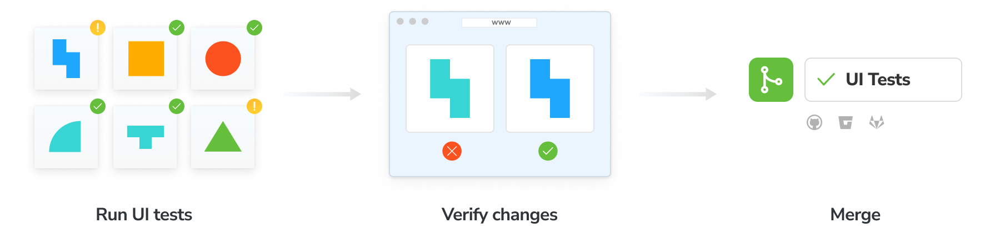
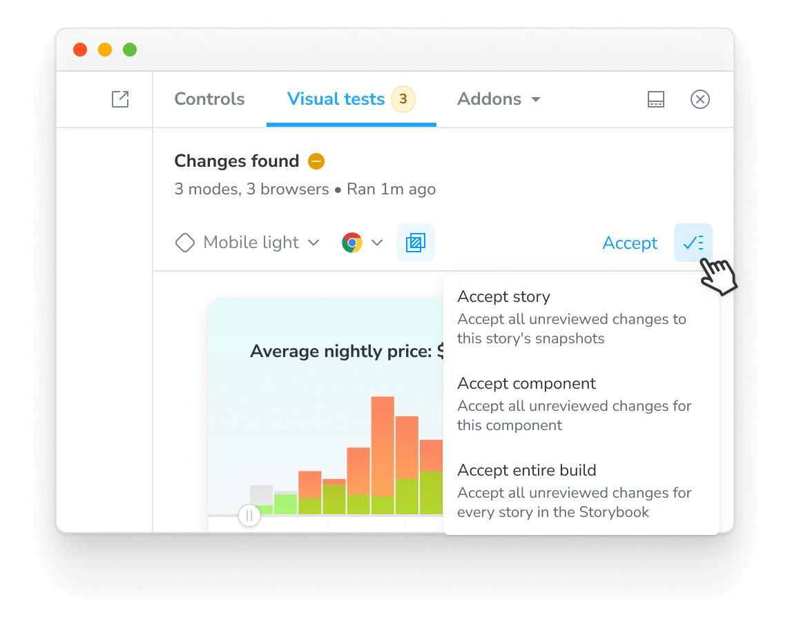
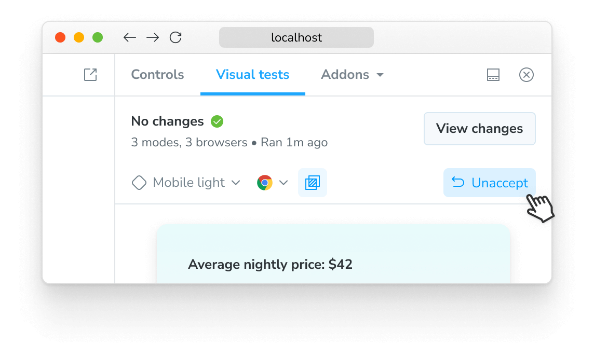

# UI Tests

UI tests pinpoint visual changes and verify user [interactions](interactions). They capture a [snapshot](snapshots) of every story in a cloud browser environment. Whenever you push code, Chromatic generates a new set of snapshots and compares them against [baseline snapshots](branching-and-baselines#baselines). If there are changes, you verify that they're intentional. If there are test errors, you get notified to fix them.

## Enable

Enable visual tests for your project on the manage page. If your stories have [interaction tests](interactions), they'll run automatically when visual tests are enabled.

All snapshots are taken in Chrome by default. Select additional browsers to expand test coverage in 1-click.

## Establish baselines

Once visual tests are enabled, you can establish baselines by [running a Chromatic build](setup#run-chromatic) in a new project or on a branch without an ancestor. This captures a snapshot of each story in a cloud browser and sets it as the baseline. Subsequent builds will generate new snapshots compared against existing baselines to detect UI changes.

## View changes between baselines

Chromatic compares new snapshots to existing baselines from previous builds in each build. The list of changes is shown in the "Tests" table in your project's build screen, with an "unreviewed" status badge.

What about component errors?

When a story fails to render, it will be badged with "Component Error". You cannot "pass" a build with component errors. Fix story errors in Storybook and rerun the build.

What about failed tests?

The story will be badged with "Failed test" when interaction tests fail. You cannot "pass" a build that has failed tests. Fix interaction tests in Storybook and rerun the build.

## Verify UI changes

Chromatic detects UI changes, but it's still up to you to verify if the changes are intentional. For intentional changes, you need to update the baseline so future tests will be compared to the _latest baseline_ for the story. If a change is unintentional, it needs to be fixed.

- ✅&nbsp;**Accept change**: This updates the story baseline. Once a snapshot is accepted, it does not need to be accepted again until it is changed, including Git branches, merges, or with the Visual Testing addon.

- ❌&nbsp;**Deny change**: This marks the change as "denied", indicating a regression and immediately fails the build originated from CI or CLI. You can deny multiple changes per build. Denying a change is only available in Chromatic's build screen and not in the addon. It will force a re-capture on the next build, even if [TurboSnap](turbosnap) would otherwise skip it.

Speed up review with keyboard shortcuts

Verify UI changes faster using keyboard shortcuts. Protip: Pressing 1 multiple times switches between the baseline and the new snapshot in the 1up view.

What about baselines on other branches?

Chromatic automatically changes the baseline snapshots used for each build, depending on your branch. Each branch has a separate set of baselines.

This means you can update UI components on multiple feature branches in parallel without conflicts. When you merge branches, the most recent baseline takes precedence. [Learn about branching and baselines »](branching-and-baselines)

How do I reproduce the snapshot?

Sometimes you need a closer look to determine why a snapshot is rendering as it does. Along with pixel and DOM diffs, Chromatic displays the interactive stories just as they appear in Storybook.

Click "Inspect snapshot" to open the Inspector. Switch between the "Canvas" and "Snapshot" tabs to compare the live component to the snapshot. Learn more about snapshots [here](snapshots).

Can I retake a snapshot?

Yes, [rerun the latest build](snapshots#rerun-builds-to-retake-snapshots) on your branch to retake snapshots of unreviewed or denied changes.

💡 If you're using the [Visual Testing addon](visual-testing-addon) to snapshot your components, you cannot trigger the rerun build workflow in Chromatic. This feature is only available when running builds from the [CLI](cli) or [CI](ci).

How are changes on builds different from those listed on the PR Screen 'Changeset' tab?

UI tests (shown on the build screen) detect changes between builds, specifically between the last accepted baseline and the latest build. This is useful for detecting defects during development and when merging to the main branch to ship.

In contrast, the PR screen shows the changeset between the latest commit on the PR branch (head) and the 'merge base' (base). Think of it like code review, but for UI.

#### Discussions

Reviewers can point out bugs or ask questions by creating discussions. Discussions are shown in situ of a UI change so all collaborators have the same reference point.

Pin discussions on a change to give precise feedback on what’s wrong. Pair discussions with denying a change to block merging until bugs are resolved.

<video autoPlay muted playsInline loop width="560px" class="center" style="pointer-events: none;">
  <source src="img/testscreen-comment-pinned-optimized.mp4" type="video/mp4" />
</video>

### With the Visual Testing addon

If you're using the [Visual Testing Addon](visual-testing-addon) to test your components, this workflow happens in Storybook. When you start a build, the addon will test your stories and compare them to the latest baselines. If the changes are intentional, the addon provides granular control when reviewing the changes, allowing you to accept individual snapshots, stories, or the entire build.

If you accept a change, intentionally or not, the addon allows you to revert it by clicking the "Unaccept" button. This will revert the change, set its status to "unreviewed" in Storybook's sidebar, and sync it with Chromatic.

## Merge

When your build is passed (all changes accepted), you’re ready to merge visual changes with confidence, knowing that your UI is bug-free. Chromatic will update the PR check for “UI Tests” to reflect the build status whether you're using the Visual Testing addon or in the build screen.

After you merge your code, Chromatic will also apply accepted baselines to stories on the target branch. That means you’ll only need to accept baselines a single time.

## PR check for "UI Tests"

Chromatic adds a 'UI Tests' check within the status checks for your pull/merge requests. The badge shows errors or changes that need to be reviewed. Require the check in [GitHub](https://help.github.com/en/github/administering-a-repository/enabling-required-status-checks), [GitLab](https://docs.gitlab.com/ee/api/commits.html#post-the-build-status-to-a-commit), or [Bitbucket](https://confluence.atlassian.com/bitbucket/suggest-or-require-checks-before-a-merge-856691474.html) to prevent accidental UI bugs from being merged.

CI setup: Chromatic will return an exit code 0 on the CLI, which can be used in CI/CD systems to indicate success and unblock deployment. [Learn about CI](ci).

---

## Next: Learn about UI Review

Now that you can catch bugs during development, learn about how to invite stakeholders into Chromatic's UI Review workflow to get the team to sign off before merging.

<a class="btn primary round" href="review">Read next chapter</a>

---

### Troubleshooting

Snapshots don't look right? Learn how to debug snapshots [here](snapshots).

Why are my builds failing because of component errors?

A build will _fail_ if any snapshots fail to render (i.e., in rendering the latest version of the component, the snapshot throws a JavaScript exception). You'll need to fix the code for errored components before we can pass the build.

Why is review disabled in my build screen?

If a build isn't the latest one, reviewing is automatically turned off, as any future builds will base themselves on the latest one, making approvals to this build pointless.

Note that in the case that there is a descendent build of this build on _a different branch_ (for instance, if the commit for this build was merged into that different branch), we do allow reviewing of this build. Future builds on this branch _will_ use approved changes from the build; however, future builds on the different branch will not. For this reason, it is best to review builds before merging them.

Why do I see "Didn't find any commits in this Git repository in the last X builds"?

This means that across the last X unique commits across all builds in your app, we didn't find a single one that exists in the repository you ran this build against. Commits can go missing if you rebase or perform squash-merges. However, something has likely gone wrong if all previous X builds' commits are missing.

If you've reached this situation and can't work out why, please contact us through our <a  class="intercom-concierge-bot">in-app chat</a> or [email](mailto:support@chromatic.com).

Why do I see "Failed to find common ancestors with most recent builds within X commits"?

This means that although we found recent builds that _were_ in your Git repository history (see above), we couldn't find any _common_ history between your checked out build and those builds within X commits.

Unless you are doing something unusual with your Git repository, this is extremely unlikely. Either way, please contact us through our in-app chat or [email](mailto:support@chromatic.com).

Why do I see "Build X is based on a commit without ancestor builds"? 

When we create a build, we search your Git history for a recent Chromatic build based on a commit that is an ancestor (i.e., a commit that is in the direct history of this commit). Unless this is the first build, we will show you this message if we do not find one.

This is typically unusual because in order to run Chromatic on a commit, chances are the commit that added Chromatic to your app is an ancestor!

However, this situation can arise due to the following:

1. You switched branches and re-ran Chromatic without checking in the code changes that installed Chromatic. In this case, you can safely ignore this message.

2. You rewrote history in merging the Chromatic installation code (e.g., using GitHub's "Squash and Merge" or "Rebase and Merge" buttons). [Learn how to resolve](github-actions#github-squashrebase-merge-and-the-main-branch)

3. You are using a shallow clone of your repository when running Chromatic. Chromatic needs access to your entire Git history to find baselines (or at least the history until the previous Chromatic build, which depends on how often you push code/run builds). [Learn about how we use Git for baselines »](branching-and-baselines)

4. Something else happened, perhaps a bug at our end? Please contact us through our in-app chat if this is the case.

Can I disable UI Tests if I prefer not to use them?

<!--

DO NOT REMOVE THIS COMMENT. Leaving it here to remind us to update this item when UI Tests and UI Review settings are turned off in Chromatic. The addon continues to run normally when it shouldn't. This is an actual bug that's being triaged.

-->

Yes. Go to the manage page for your project, where you can disable UI Tests. If you're running Chromatic from CI, the status check will be removed from your PRs. If you're using the Visual Testing addon it will allow you to continue using the addon without running UI Tests.

Why does my build have failed tests?

"Failed tests" happen when a story's [play function](https://storybook.js.org/docs/react/writing-stories/play-function) has an unexpected error that causes it to fail. You can learn more about interaction tests [here](https://storybook.js.org/docs/react/writing-tests/interaction-testing).

Can I rerun a build without running my whole CI workflow?

Yes. You can [rerun the latest build on any branch](snapshots#rerun-builds-to-retake-snapshots) outside of your CI workflow. Go to the build page to kick off a new build that uses identical settings and configuration as your old build.

What happens if I deny a build created with the addon?

Builds originating from the addon are treated differently than builds created from CI or the CLI. Denying the changes will only notify you of the change in your Storybook instance with a visual indicator in the sidebar. We advise against denying changes and instead unaccepting them if you want to revert them.

