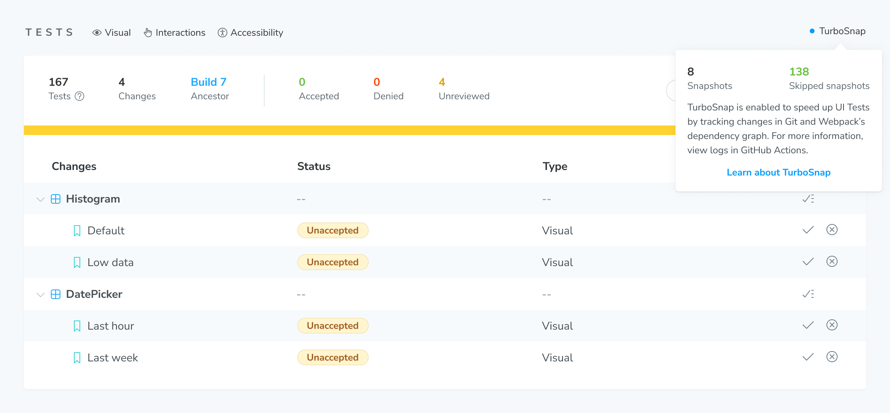

# TurboSnap

TurboSnap is an advanced Chromatic feature that speeds up builds for faster [UI testing](test) and [review](review) using Git and Webpack's [dependency graph](https://webpack.js.org/concepts/dependency-graph/). It identifies component files and dependencies that have changed, then intelligently snapshots only the stories associated with those changes.

⚠️ When using TurboSnap, your builds may complete in less time using fewer snapshots. However, we don't allow using TurboSnap immediately when starting out with Chromatic since the configuration is more complicated and can lead to difficult to debug scenarios or UI changes being missed. Instead, become familiar with Chromatic's out-of-the-box behavior, and once your project has been running smoothly, consider trying out TurboSnap. TurboSnap is unlocked after ten successful builds on CI, at least one of which is accepted.

#### Prerequisites

- Chromatic CLI [5.8+](https://www.npmjs.com/package/chromatic)
- Storybook 6.2+
- Webpack (for experimental Vite support, see [vite-plugin-turbosnap](https://github.com/IanVS/vite-plugin-turbosnap))
- Stories correctly [configured](https://storybook.js.org/docs/react/configure/overview#configure-story-loading) in Storybook's `main.js`
- For GitHub Actions: run on `push` rather than `pull_request` ([learn more](#github-pullrequest-triggers))

## Enable

Run Chromatic's CLI with the `--only-changed` option to enable TurboSnap. Alternatively, you can use the `onlyChanged` option for the Chromatic GitHub action.

It will build and test stories that may have been affected by the Git changes since the last build. Depending on your project setup, you may need [additional configuration](#configure).

### How it works

1.  Chromatic considers the Git changes between the current commit and the commit of the [ancestor build](branching-and-baselines#calculating-the-ancestor-builds).
2.  Chromatic then uses Webpack's dependency graph to track those changes back up to the story files that depend on them.
3.  Chromatic only tests the stories defined in those story files.

Stories that have not changed will not be tested (i.e., snapshotted), despite appearing in Chromatic's UI as if they were. In many cases, this will lead to much-decreased snapshot usage and faster build times.

#### Full rebuilds

Certain circumstances could potentially affect all stories. To prevent false positives, we re-test everything if any of the following situations apply:

- Changes to dependency versions in `package.json`, if no valid lockfile is available
- Changes to your Storybook's configuration
- Changes in files that are imported by your [`preview.js`](https://storybook.js.org/docs/react/configure/overview#configure-story-rendering) (as this could affect any story)
- Changes in your static folder (if specified using `--static-dir` / `-s`)
- Changes to files specified by the `--externals` option (see below)
- Re-run of the same build (commit and branch match the parent build)
- [Infrastructure upgrades](infrastructure-upgrades)
- [UI Test in a new browser](browsers)

#### Missing commits (rebasing)

Under the hood, TurboSnap works by calculating the difference between the current commit and its ancestor. However, there are certain cases (i.e., rebasing, force pushing) where the commit linked to the previous build no longer exists in the repository, which prevents Chromatic from doing this computation accurately.

In this case, it will search the existing builds until it finds a suitable "replacement build" with a valid commit in the repository. Once found, it approximates the difference between the two commits alongside any UI changes. This can lead to a story being re-tested if one of the following requirements is met:

- Code changes detected (according to Git) between the current and replacement commit
- Visual changes identified (according to Chromatic) between the ancestor build and the replacement commit's build

## Configure

To enable TurboSnap for your project, add the `--only-changed` flag to your `chromatic` script, or add the `onlyChanged: true` option to your GitHub workflow config.

```json
{
  "scripts": {
    "chromatic": "chromatic --only-changed"
  }
}
```

Or for GitHub Actions:

```yaml
steps:
  # ...
  - name: Publish to Chromatic
    uses: chromaui/action@v1
    with:
      projectToken: ${{ secrets.CHROMATIC_PROJECT_TOKEN }}
      onlyChanged: true
```

You may need additional config in the following situations:

- You're using `--storybook-build-dir` or `-d` to let Chromatic use a prebuilt Storybook
- You are using the `staticDirs` config in your main Storybook configuration
- You have other files outside the Webpack dependency tree which affect your stories (e.g., Sass or template files)
- You have files that should never trigger a re-test (e.g., in a monorepo)
- You want to enable or disable TurboSnap for specific branches

### Prebuilt Storybook

If you're using `--storybook-build-dir` to provide a prebuilt Storybook, adjust your `build-storybook` script to include the `--webpack-stats-json` option. If Chromatic builds your Storybook for you, this is unnecessary, and will take care of it. For example:

```json
{
  "scripts": {
    "build-storybook": "build-storybook --webpack-stats-json"
  }
}
```

In Storybook 6.2, `--webpack-stats-json` must be set to the value of `--output-dir` (`storybook-static` by default). In Storybook 6.3+, the value can be omitted as it automatically uses the value of `--output-dir`. Note that `--webpack-stats-json` was not supported before Storybook 6.2 and, therefore, cannot be used with TurboSnap.

#### Specify a deviating Storybook base directory

If you're using a prebuilt Storybook, and your `build-storybook` script was not executed from the same directory where you're running `chromatic`, you'll have to specify the relative path to the Storybook project root (where you run `build-storybook` from). For example, when your Storybook lives at `./services/webapp` in your Git repository:

```json
{
  "scripts": {
    // This would be a different package.json than the one with `build-storybook`
    "chromatic": "chromatic --only-changed --storybook-base-dir services/webapp"
  }
}
```

If you're running `chromatic` from the same subdirectory as `build-storybook`, this should not be necessary, as Chromatic will auto-detect the correct base dir.

### Specify external files to trigger a full re-test when they change

TurboSnap relies on Webpack's dependency graph. That means if you're using files processed externally to Webpack, with the output consumed by Webpack, you'll need to trigger a re-test when they change. This includes static assets like fonts, images and CSS files, as well as files that compile to static assets such as Sass, so long as they are not processed through a Webpack loader.

For example, if you use an external Sass compiler (not `sass-loader`) to compile `.sass` files to `.css` files (which may then be consumed by Webpack), then a change to a `.sass` file will not match any dependencies, preventing stories from being captured (i.e., snapshotted).

To work around this, run Chromatic's CLI with the `--externals` option (or `externals` action option) to specify one or more globs of "externally processed" files. For example:

```shell
chromatic --only-changed --externals "*.sass" --externals "public/**"
```

> If you are using the [`staticDirs`](https://storybook.js.org/docs/react/configure/images-and-assets#serving-static-files-via-storybook-configuration) option in your main Storybook config (introduced in Storybook 6.4), you should flag those as externals as well. While the deprecated `--static-dir` (`-s`) Storybook CLI flag is auto-detected, the config option in `main.js` is not.

### Avoid re-testing dependent stories when certain files changed

You may have certain files in your Webpack dependency graph which are (indirectly) used by a story but which you know are unlikely to cause a meaningful (visual) change. A typical example is a global decorator that imports some utility files. Since a global decorator applies to all stories, changing such a utility file would cause the entire Storybook to be re-tested. You can avoid that problem using the `--untraced` flag:

```shell
chromatic --only-changed --untraced ".storybook/decorators/*.js"
```

TurboSnap works by taking a list of changed files in your Git repository and tracing those down to a set of story files. The `--untraced` flag allows you to skip tracing dependencies for certain files. That means any file in the Webpack dependency graph matching `--untraced` will be ignored, and thus stories (indirectly) depending on it will not get marked for re-testing at that time. However, those stories still might get marked as a result of tracing another changed file (via a different dependency chain).

> Keep in mind that your tests will be less reliable when using `--untraced` because it may skip stories that actually did have meaningful changes. It's recommended to disable TurboSnap on your main branch (see below) so that you can at least catch such changes.

`--untraced` is particularly useful when you're importing "index" files that re-export a bunch of underlying modules. A change to any of these modules would cause any file that imports the index file to be considered "dirty", even if it doesn't actually use the changed module. By using `--untraced` on the index file, all of its re-exported modules are automatically untraced as well, as long as they aren't imported directly.

#### Avoid re-testing on changes to package control files

When certain files that pertain to `node_modules` (`package.json`, `package-lock.json`, `yarn.lock`) change, TurboSnap attempts to determine an exact set of changed dependencies and trace those dependencies to associated stories. We rely on lock file(s) to get actual version numbers rather than semver ranges. TurboSnap retrieves versions for both the current state of the repository and for each baseline commit. If a lockfile is missing or out of sync with package.json, TurboSnap cannot do this, and we'll have to re-test all stories.

Similar to source code changes, the `--untraced` flag can also be used to ignore dependency updates (e.g., `--untraced "services/backend/package.json"`). That way, any dependency updates in that package will not be considered when applying TurboSnap. A typical use case scenario would be to untrace the `services/backend/**` directory and ignore _any_ changes, including dependencies. If you need fine-grained control over what is untraced, you can also enable it for a specific lockfile, with the caveat that untracing the root-level lockfile will ignore any dependency changes in _all_ packages that rely on it (i.e., sub-packages that don't have their lockfile).

### Enable or disable for specific branches

To enable TurboSnap for specific branches, pass a glob to `--only-changed` (e.g., `chromatic --only-changed "feature/*"`). Use a negating glob (e.g. `chromatic --only-changed "!(main)"`) to enable all but certain branches. See [picomatch] for details.

### Confirm TurboSnap is working

The best way to see if TurboSnap is working is to inspect your CLI output. There are a couple of messages the CLI outputs of particular relevance:

```shell
Traversing dependencies for X files that changed since the last build
```

<div class="aside">
This message tells us how many git changes Chromatic has detected since the last Chromatic build. Usually, that's just one or two commits' worth of files.
</div>

```shell
Found Y story files affected by recent changes
```

<div class="aside">
This message tells you the number of story files that depend on the X changes above. This message also might be replaced by a message telling you that we need to capture all stories (<a href="#why-are-full-rebuilds-required">see below</a>).
</div>

```shell
Tested A stories across B components; capture C snapshots in S seconds.
```

<div class="aside">
This message tells you how many snapshots we actually took instead of the number of stories we found in your Storybook. Usually, C would be the number of stories in the Y component files above.
</div>

Once TurboSnap is activated, all subsequent builds will display an indicator with TurboSnap's status. Find it on the Build page above your tests.



### Notes on monorepos

TurboSnap will make working in a monorepo more efficient. Because it detects affected stories based on the actual files changed, pushing a commit that touched only backend code will run faster in CI and not use up your snapshot quota. However, it will still build and publish your Storybook. To avoid that, you can [skip Chromatic entirely](monorepos#only-run-chromatic-when-changes-occur-in-a-subproject), speeding up your CI pipeline even more.

If your monorepo has stories from multiple subprojects coming together in one Storybook, you might currently [run Chromatic on a subset of your Storybook](monorepos#run-tests-on-a-subset-of-stories). With TurboSnap enabled, that happens automatically. You'll be able to build and publish your entire Storybook, but Chromatic won't test unchanged subprojects or take snapshots of those stories. You no longer need to build a subset of your Storybook manually.

[picomatch]: https://www.npmjs.com/package/picomatch#globbing-features

---

## Compatibility

#### GitHub pull_request triggers

GitHub workflows have various "triggers" that a Chromatic action could run on. We recommend sticking to `push` unless you know what you're doing.

TurboSnap is _not_ compatible with the `pull_request` trigger or its variations. The reason is that `pull_request` workflows run against an ephemeral merge commit, which doesn't exist in your Git history yet, but _would_ if you were to merge the PR at that point.

If your pull requests trigger multiple builds before being merged, Chromatic would not be able to find those earlier builds because your Git history does not actually contain the commit for which you ran a Chromatic build.

Our own GitHub Action works around that by using `pull_request.head.sha` as the commit hash for the build, even though it's really running against the merge commit so that we can still track baseline history. However, this discrepancy means TurboSnap would be looking at a different set of changed files than were actually in the recorded commit (which depends on the state of your base branch), yielding unpredictable results.

---

### Troubleshooting

<details>
  <summary>Why are no changes being detected?</summary>

If the messages above indicate no story files are being detected by changes, then possibly there is an issue matching up the git changes with the files in your Storybook build. Use the <code>--debug</code> flag to get more information about what Chromatic is doing.

Another reason that changes may be missed is if the changed files aren't directly included in the webpack build; use the <a href="#specify-which-changes-trigger-a-full-re-test"><code>--externals</code> flag</a> to tell Chromatic about this.

If you're trying to figure out why certain stories are being re-tested, you can pass the `--trace-changed` flag, which will print a visual report of how changed files link to your story files:

```shell
npx chromatic --only-changed --trace-changed
```

Alternatively, using the `trace` utility, you can manually trace a set of files to a set of related story files based on a Webpack stats file. First, you need to generate a `preview-stats.json` like so (requires Storybook >=6.3):

```shell
npx build-storybook --webpack-stats-json
```

The `preview-stats.json` will end up in the build directory, typically `storybook-static`. If you want to inspect this file manually, you can trim it down to its bare essentials using this command:

```shell
npx chromatic trim-stats-file
```

Or, if you're using a custom build directory:

```shell
npx chromatic trim-stats-file ./path/to/preview-stats.json
```

This will output a `preview-stats.trimmed.json` file which should be much more human-readable (sort of).

Now, to trace a set of changed file paths to their dependent story files, run the following:

```shell
npx chromatic trace [...changed file paths]
```

For example:

```shell
npx chromatic trace ./src/components/link.js ./src/pages/index.js
```

This prints the number of detected CSF globs, the total number of modules, and a map of `Webpack module ID -> file path` for each of the found story files (typically `*.stories.js`).

Example output:

```json
Found 2 CSF globs
Found 218 user modules
{
  '114': './src/components/buildPassed.stories.js',
  '228': './src/components/buildHasChanges.stories.js',
  '229': './src/components/storybookPublished.stories.js',
  ...
}
```

In this example, it found 2 CSF globs, which are the `stories` configured in your Storybook's `main.js` config file. From those globs, it detected a total of 218 modules (i.e., source files traceable from those globs via imports). What follows is a list of stories files, the IDs of which will get sent to Chromatic and used to limit the stories files to be tested.

If this list of files contains things you didn't expect, look at any global decorators (e.g., theme providers, wrapper components). These are typically configured in Storybook's `preview.js` file. You might have a decorator that's imported from e.g. an `index.js` file, which itself imports a bunch of other files. This can lead to _all_ stories depending on a big swath of seemingly unrelated files.

</details>

<details>
  <summary>Why are full rebuilds required?</summary>

Full rebuilds can be required for various reasons (see the list in <a href="#how-it-works">how it works</a>). Another scenario where a full rebuild will also be required is due to a change to a <code>package.json</code> or lock file for a subproject that doesn't affect the Storybook (we need to be very conservative as we cannot tell if a change to a lock file could affect <code>node_modules</code> imported by Storybook).

  <div class="aside">
    If you run into this situation frequently, upvote the <a href="https://github.com/chromaui/chromatic-cli/issues/383">open issue</a> in the Chromatic CLI's issue tracker to opt-out of this behavior for specific directories in your repository.
  </div>
</details>

<details>
  <summary>Why is my build failing with an <code>Out of memory error</code>?</summary>

If you have a large dependency tree, the build process may fail due to an out of memory error. Re-run Chromatic's CLI with the `NODE_OPTIONS=--max_old_space_size=4096` (or higher) environment variable to increase the amount of available memory. Your CI provider may require additional configuration to allow more memory usage.

</details>

<details>
  <summary>Why do merge commits test more changes than I expect?</summary>

Ordinarily, TurboSnap uses git to find all files that have changed since the <a href="/docs/branching-and-baselines#calculating-the-ancestor-builds">ancestor build</a> to determine which components/stories to snapshot. The changed file behavior is more complex with merge commits because there are two "ancestor builds".

When you have a merge commit, Chromatic considers **any file that has changed since either ancestor's commit** to decide if a story needs to be re-snapshotted. In other words, the union of the git changes.

The reason for this behavior relates to what Chromatic does when it chooses not to re-snapshot a story. In such case, it "copies" the snapshot for the story from the ancestor build, knowing (due to the git check) that the story cannot have changed in the meantime.

In the case of merge commits, Chromatic does not know ahead of time which side of the merge the snapshot might be copied from because that involves running the <a href="/docs/branching-and-baselines#calculating-a-snapshot-baseline-from-the-ancestor-builds">complete baseline selection</a> process, so it needs to be conservative and allow for changes on either branch.

</details>

<details>
  <summary>Does TurboSnap work with squash/rebase merge?</summary>

TurboSnap is compatible with squash and merge rebasing as of version 6.6+. Please update your package to get support.

</details>
