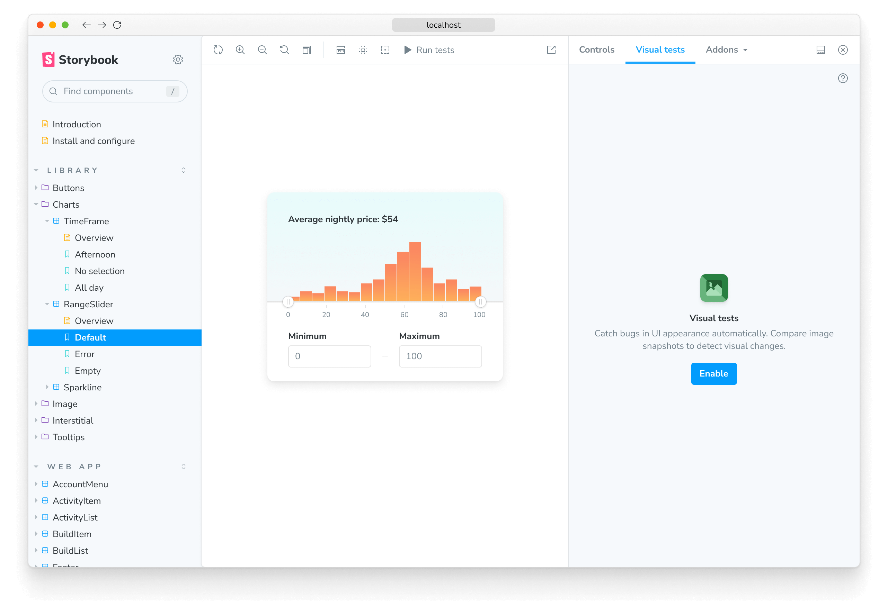
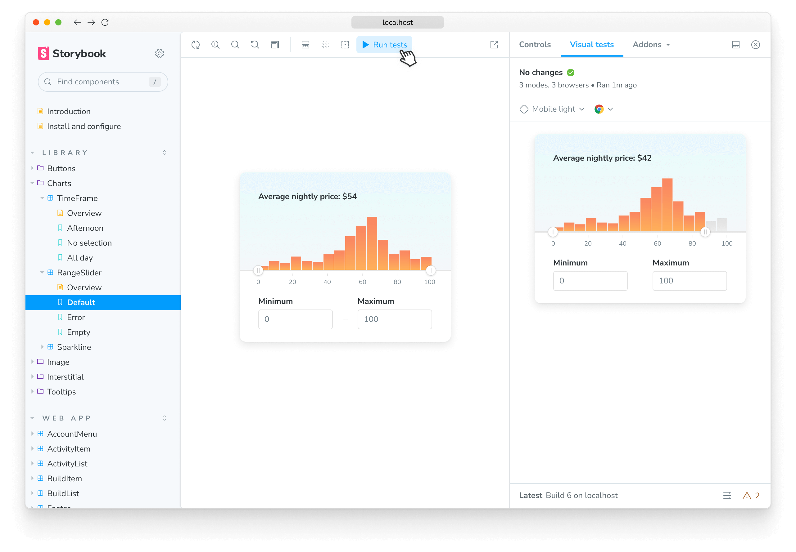
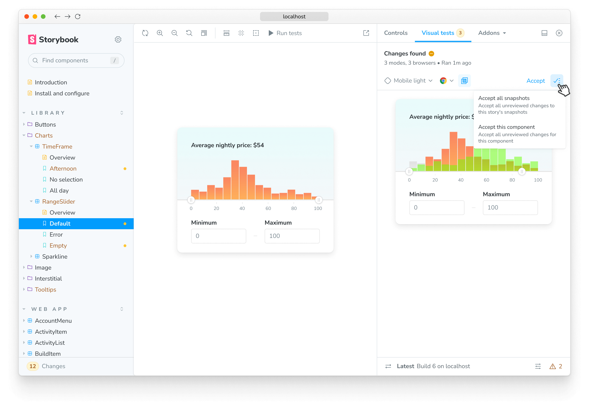

# Visual testing addon for Storybook

<div class="aside">

🧪 **Experimental** We're actively integrating feedback from [early access users](https://forms.gle/NCDV1BMGuNfjWrPm9). As a result, both APIs and functionality may undergo potential changes.

</div>

<!-- This is required to avoid the aside from overlapping into the text. -->

<p></p>

Chromatic's Visual Testing addon is essential for detecting UI bugs during development. It enables you to run visual tests on your stories and compare changes with the latest baselines across multiple viewports and browsers to catch UI regressions early in development without leaving Storybook.

## Installation

To enable visual testing with Storybook, you must take additional steps to set it up properly. We recommend that you have a fully functional Storybook project running the latest version (e.g., 7.2 or higher) and a Chromatic [account](access) configured with a project to which you have access.

Run the following command to install the addon:

```shell
yarn add --dev @chromaui/addon-visual-tests
```

Update your Storybook configuration file `.storybook/main.js|ts` file to include the addon:

```js
// .storybook/main.js

const config = {
  stories: ["../src/**/*.mdx", "../src/**/*.stories.@(js|jsx|mjs|ts|tsx)"],
  addons: [
    // Other Storybook addons
    "@chromaui/addon-visual-tests",
  ],
};
export default config;
```

## Authentication

Before using the visual testing addon, you must authenticate yourself with Chromatic. Click the "Enable" button in the addon panel and follow the onboarding workflow to set up your account and link your existing Storybook instance with Chromatic. After the authentication process is complete, you'll be redirected back to Storybook, where you'll see a list of available projects to which you have access.



<div class="aside">

💡 As part of the authentication process, the addon will ask you for light permissions to access your Chromatic account. The addon will only use this information to authenticate you and to synchronize your visual tests with Chromatic. The addon will never use this information for any other purpose.

</div>

Select the project on which you want to run your visual tests to complete the onboarding process. The addon will automatically save your selection, adjust the configuration file to include the necessary project identifiers, and retrieve the latest baselines if available.

## How to run visual tests

Get started visual testing by introducing a change in one of your components; for example, change a background color or font size, save the file, and commit your local changes. Click the "Run tests" button in the toolbar to begin the process. The addon will connect to Chromatic, trigger a local build, snapshot your components, including [browsers](browsers) and [viewport sizes](viewports), and compare them against the latest baseline available in Chromatic.



## Review changes

To find out which changes were introduced in the latest build, the addon highlights the stories that require your attention. Cycle through them and review them. If the changes are intentional, click the "Accept" button to update the baseline with the latest changes. This will ensure that when you push the changes into your remote repository, they will be reconciled with the public build and automatically marked as accepted in Chromatic.



## Troubleshooting

<details>
<summary>Why is my private project token available in the configuration?</summary>

Currently, the visual testing addon is still in its early access stage, and we're actively working on enhancing the user experience and the overall stability of the addon. Therefore, the behavior you're experiencing is expected. We suggest storing the token in a `.env` file if you have any security concerns.

</details>

<details>

<summary>Why is the addon reporting that my snapshots are outdated?</summary>

By default, the addon uses a similar approach to Git to determine which files have changed and require testing. However, specific files (e.g., `build-storybook.log`) can be incorrectly detected and cause the addon to notify you that the snapshots are outdated. Add the necessary files to your `.gitignore` file to prevent this from happening.

</details>

<details>
<summary>Running Storybook with the addon enabled throws an error</summary>

When running Storybook with the addon enabled, you may encounter the following error:

```shell
const stringWidth = require('string-width');

Error [ERR_REQUIRE_ESM]: require() of ES Module /my-project/node_modules/string-width/index.js is not supported.
```

This is a known issue when using an older version of the Yarn package manager (e.g., version 1.x). To solve this issue, you can upgrade to the latest stable version. However, if you cannot upgrade, adjust your `package.json` file and provide a resolution field to enable the Yarn package manager to install the correct dependencies. In doing so, you may be required to delete your `node_modules` directory and `yarn.lock` file before installing the dependencies again.

```json
{
  "resolutions": {
    "jackspeak": "2.1.1"
  }
}
```

</details>
