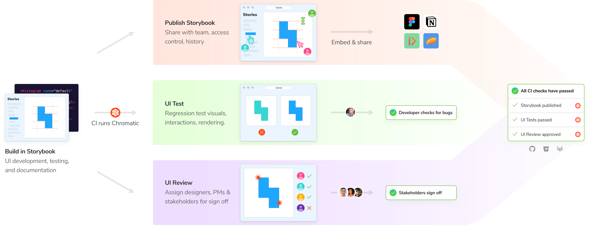

# How to use Chromatic

Chromatic automates UI development so you can build more features, faster, and with less manual work. Here's the recommended workflow that takes full advantage of everything we have to offer.

### 1. Build in Storybook

Build UI components in isolation with Storybook. Use [Component-Driven Development](https://www.componentdriven.org/), a process for building UIs from the "bottom up" starting with components and ending with screens.

### 2. Publish on Chromatic

Publish Storybook to Chromatic's secure workspace (CDN) that's accessible to your entire team. That keeps everyone in sync with the latest UI implementation. No fussing with dependencies, `git`, or local dev environments.

### 3. UI Test to catch bugs

Once Storybook is published in the cloud, Chromatic's cloud infrastructure automates UI tests to catch regressions. Developers find and fix UI bugs during development. When the tests pass, the UI is considered "ready" and moves on to review.

### 4. UI Review to get team sign off

Now that the UI has no obvious flaws, bring in designers, PMs, and other stakeholders to confirm that the UI meets specifications. Developers often fill in edge cases and overcome technical hurdles while coding. Review is the opportunity to sync those in-development updates with teammates to get a final sign off.

### 5. Document to reuse later

When the UI is production-ready, document it so future developers don't have to rebuild the same thing. This is automatic with Chromatic. Every component is documented, versioned, and searchable in the cloud.

Tip: Use <a href="https://storybook.js.org/docs/react/writing-docs/introduction" target="_blank">Storybook Docs</a> to auto-generate minimum viable docs which can be further customized as your needs grow.

### 🚀 Merge with confidence

You're ready to merge! When you build components in Storybook you also unlock Chromatic's automated cloud services for testing, review, and documentation.

---

## Conclusion

You finished setting up Chromatic. We look forward to the incredible UIs you'll build.

#### Our most popular guides and articles

- [Intro to Storybook](https://www.learnstorybook.com/intro-to-storybook/) is the essential guide to learning Storybook.
- [Design Systems for Developers](https://www.learnstorybook.com/design-systems-for-developers/) shares how to build production infrastructure for design systems.
- [Visual Testing Handbook](https://www.learnstorybook.com/visual-testing-handbook/) details how professional frontend teams visual test with Storybook.
- [Component-Driven Development](https://www.componentdriven.org/) is a "bottoms up" process for building modular UIs starting from components and ending with screens.
- [UI Component Playbook](https://blog.hichroma.com/ui-component-playbook-fd3022d00590) is a 5-step overview of designing and engineering frontends with components

#### How to get support

You're supported by the team behind Storybook. For the quickest response, [login](https://www.chromatic.com/start) and use the in-app chat. Email us at [support@chromatic.com](mailto:support@chromatic.com?Subject=Question).
